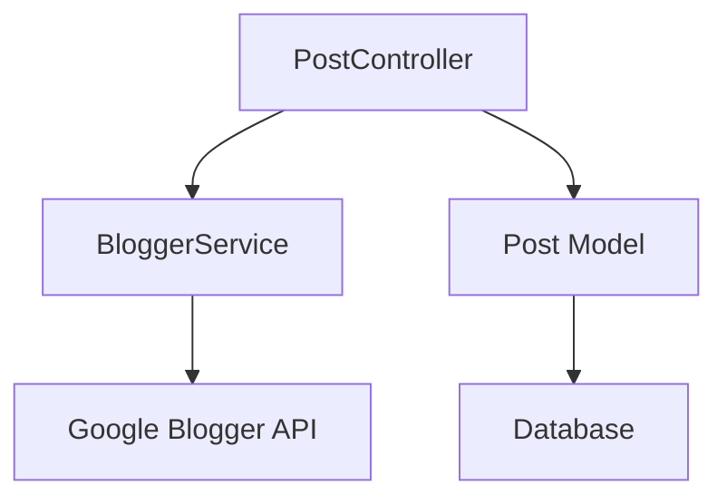
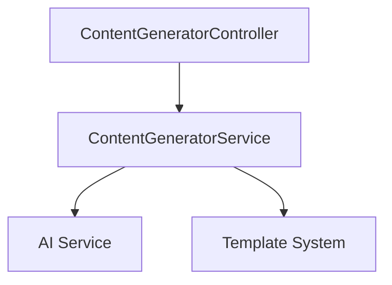
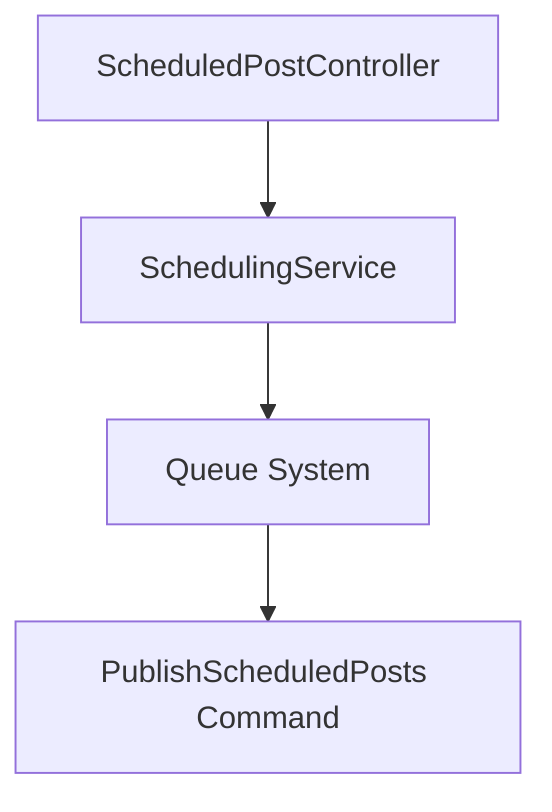
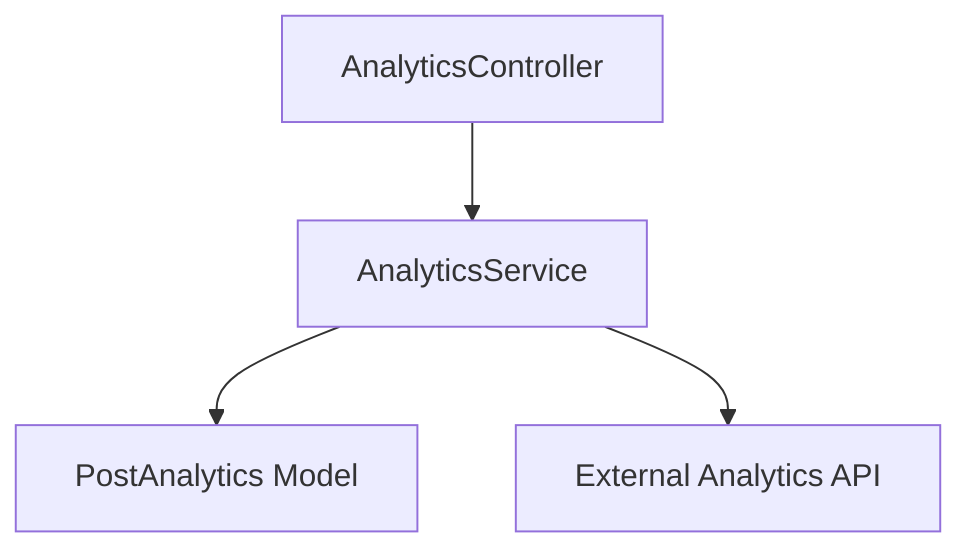
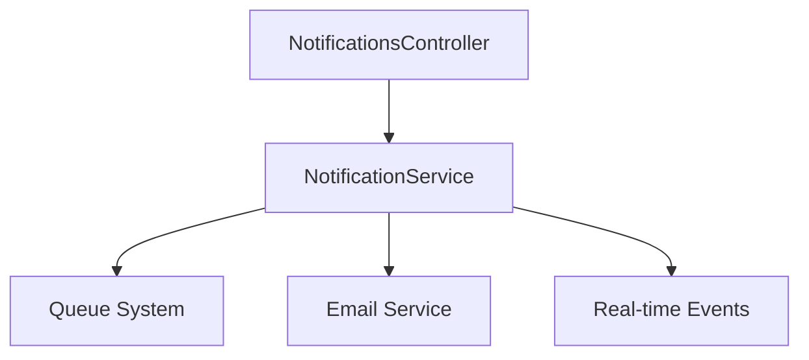
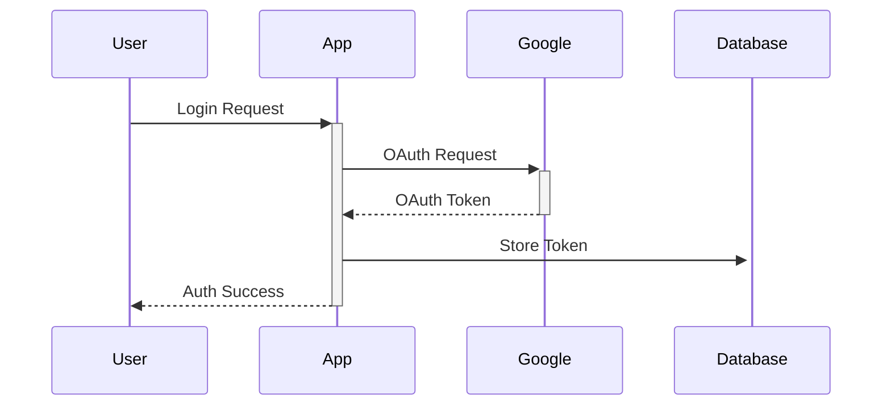
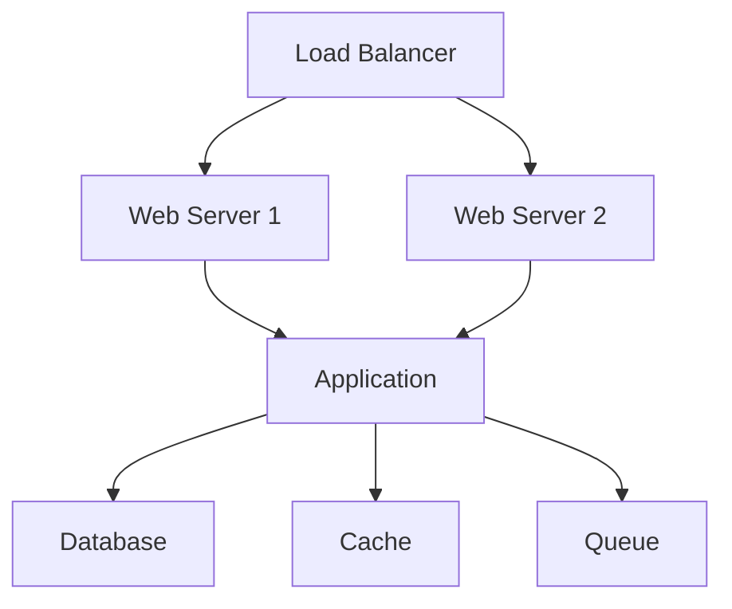

# System Architecture Documentation

## Overview

BlogPoster is built on Laravel framework following a modern MVC architecture with additional service layers and domain-driven design principles.

## Architecture Layers

```
├── Application Layer
│   ├── HTTP Controllers
│   ├── Console Commands
│   └── Middleware
├── Domain Layer
│   ├── Models
│   ├── Services
│   └── Policies
├── Infrastructure Layer
│   ├── Database
│   ├── External Services
│   └── Queue System
└── Presentation Layer
    ├── Views
    ├── Assets
    └── Components
```

## Core Components

### 1. Authentication System
- Google OAuth2 integration
- Token management
- Session handling
- Middleware protection

### 2. Post Management


### 3. Content Generation


### 4. Scheduling System


### 5. Analytics System


### 6. Notification System


## Database Schema

### Core Tables
```sql
users
├── id
├── name
├── email
└── google_id

posts
├── id
├── user_id
├── title
├── content
├── status
└── blogger_post_id

oauth_tokens
├── id
├── user_id
├── access_token
├── refresh_token
└── expires_at
```

### Feature Tables
```sql
scheduled_posts
├── id
├── post_id
├── scheduled_at
└── status

post_analytics
├── id
├── post_id
├── views
├── likes
└── comments

notifications
├── id
├── user_id
├── type
├── data
└── read_at
```

## Service Integration

### External Services
1. Google OAuth
2. Blogger API
3. Email Service
4. Analytics APIs

### Internal Services
1. Queue System (Laravel Jobs)
2. Cache System (Redis)
3. Event Broadcasting
4. Task Scheduling

## Security Architecture

### Authentication Flow


### Authorization
- Policy-based access control
- Role-based permissions
- Resource ownership validation

### Data Protection
- Encrypted storage
- Secure communication
- Token management
- Rate limiting

## Performance Optimization

### Caching Strategy
1. Query Results
2. API Responses
3. View Components
4. Configuration

### Queue System
1. Email Notifications
2. Analytics Processing
3. Post Publishing
4. Report Generation

## Monitoring & Logging

### System Monitoring
- Performance Metrics
- Error Tracking
- Queue Monitoring
- API Health Checks

### Logging
- Application Logs
- Access Logs
- Error Logs
- Security Logs

## Scalability Considerations

### Horizontal Scaling
- Stateless Application
- Distributed Caching
- Load Balancing
- Session Management

### Vertical Scaling
- Database Optimization
- Query Performance
- Resource Management
- Memory Usage

## Deployment Architecture

### Production Environment


### Development Environment
- Local Development
- Testing Environment
- Staging Environment
- CI/CD Pipeline

## Error Handling

### Error Levels
1. Application Errors
2. System Errors
3. External Service Errors
4. Validation Errors

### Recovery Procedures
1. Automatic Retry
2. Fallback Options
3. User Notification
4. Admin Alert

## Maintenance Procedures

### Regular Maintenance
- Database Optimization
- Cache Clearing
- Log Rotation
- Backup Verification

### Emergency Procedures
- Service Recovery
- Data Recovery
- Error Resolution
- Security Incident Response

## Future Considerations

### Planned Improvements
1. Microservices Architecture
2. GraphQL API
3. Real-time Analytics
4. Enhanced AI Features

### Scalability Plans
1. Database Sharding
2. Content Delivery Network
3. Distributed Processing
4. Geographic Distribution
